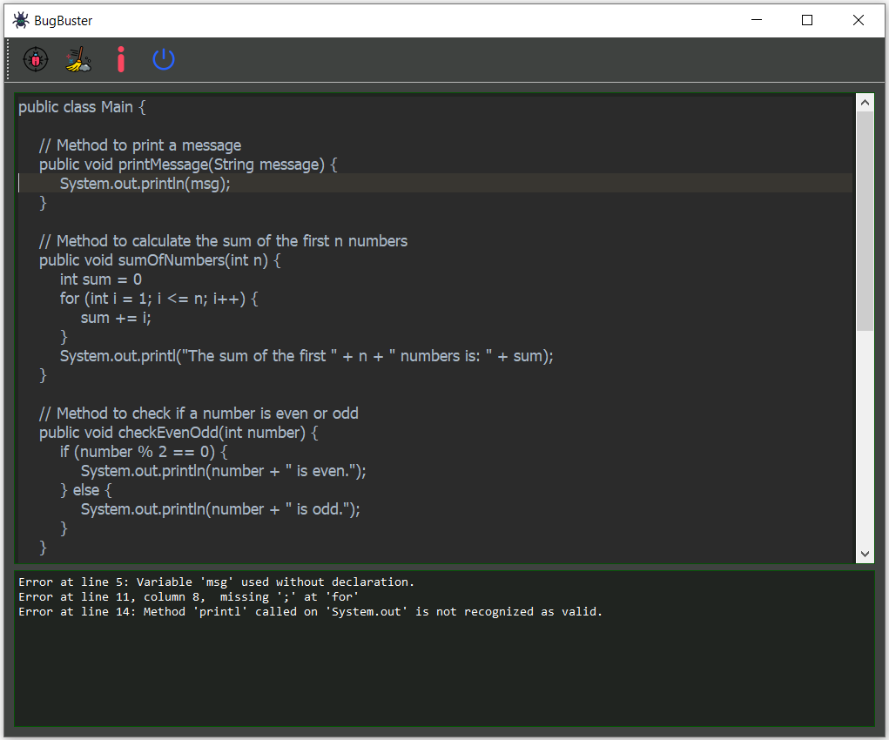

#   **ANTLR4-BugBuster**

This project was developed for the ["Formal Languages and Compilers"](https://unibg.coursecatalogue.cineca.it/insegnamenti/2023/3212_35538_10011/2021/3212/89?coorte=2022&schemaid=68842) course, which is part of the master's degree program in Computer Engineering. It aims to create a **code analyzer** capable of detecting lexical, syntactic, and semantic errors in a simple programming language based on a **Java-like grammar** defined by a custom grammar. 

The grammar, while not complete, was designed to explore the capabilities of **ANTLR4** and demonstrate how to bridge theoretical concepts with practical applications. The project aims to showcase the process of building a lexer and parser for a Java-like language, integrating these components with a **PyQt5**-based user interface to allow interactive analysis of code.

The analyzer uses **ANTLR4** to generate the lexer and parser, while the user interface (GUI) is built using **PyQt5**, providing a platform to visualize and correct errors in the source code. 

---

The application allows users to:
- Perform tokenization of source code through a lexer generated by ANTLR.
- Analyze the syntactic structure of the code with a parser and create a syntax tree.
- Conduct semantic checks on the code using a visitor pattern to verify the validity of declarations and operations.
- Provide an interactive graphical interface to load code, view errors, and easily correct them.


---
### Course Overview
In the ["Formal Languages and Compilers"](https://unibg.coursecatalogue.cineca.it/insegnamenti/2023/3212_35538_10011/2021/3212/89?coorte=2022&schemaid=68842) course, we explored a wide range of fundamental theoretical and practical concepts for understanding and implementing programming languages and compilers. The main topics of the course include:

1. **Basic Concepts**: Introduction to alphabets, strings, languages, and operations on them.
2. **Regular Expressions and Languages**: Study of regular expressions, their composition rules, and the properties of regular languages.
3. **Finite State Automata**: Exploration of deterministic (DFA) and non-deterministic (NFA) automata, including those with ε-moves.
4. **BNF (Backus-Naur Form) Grammars**: Analysis of formal grammars, derivation, parse tree construction, and parsing techniques such as LL(1), LR(0), and LALR(1).

---

### Connections with Course Material

This project directly applies several key concepts covered in the "Formal Languages and Compilers" course, bridging theory with practical implementation. The main areas of connection are:

1. **Lexical Analysis (Regular Expressions and Finite State Automata):**  
   The lexer for the code analyzer utilizes regular expressions to define the patterns for valid tokens in the programming language. This ties into the study of regular languages and the properties of finite state automata (FSA). ANTLR, the tool used to generate the lexer, relies on these concepts to break down source code into tokens, similar to how deterministic (DFA) and non-deterministic finite automata (NFA) process input strings.

2. **Syntactic Analysis (BNF and Parsing Techniques):**  
   The grammar used in the project is designed in Backus-Naur Form (BNF), a formal notation introduced in the course for describing the syntax of programming languages. The project also involves generating a syntax tree through parsing, which directly relates to techniques like LL(1), LR(0), and LALR(1) parsing. ANTLR employs parsing algorithms based on these principles to ensure syntactic correctness in the input code.

3. **Semantic Analysis (Visitor Pattern and Symbol Table):**  
   The use of the visitor pattern for semantic analysis aligns with the course’s exploration of compiler design. Specifically, semantic analysis ensures that the operations within the code are valid in terms of variable declarations, type checking, and scoping. This step checks the correctness of expressions and statements, ensuring that the code adheres to language-specific rules beyond syntax.

4. **Error Detection and Reporting:**  
   The error handling mechanism in the analyzer—detecting lexical, syntactic, and semantic errors—echoes the principles discussed in the course related to the construction of error handling and reporting systems in compilers. Through this project, we can see how errors are caught at different stages of compilation and how user-friendly feedback can be provided through the graphical interface.


---

## Project Components

### 1. `Language.g4`
   - Defines the grammar of the language being analyzed.

### 2. `main.py`
   - The main file that launches the graphical interface.
   - Contains the `CodeAnalyzerGUI` class that builds the interface with PyQt5, including an area for code input, an output console, and a "Run" button to execute the analysis.
   - The `run_analysis` function collects the user's code, passes it to the lexer, parser, and visitor to perform all checks.

### 3. `semantic_analyzer.py`
   - Contains the implementation of the semantic analyzer, which checks the validity of the code’s logic and ensures that declarations, types, and operations are consistent.
   - Uses the `Visitor pattern` to traverse the Abstract Syntax Tree (AST) generated by the parser.
   - `Symbol Table Management:` Handles symbol table creation and updates for variables and functions, checking for issues such as undeclared variables or multiple declarations of the same name.
   - `Type Checking:` Verifies that operations are type-consistent, ensuring that variables are used in ways that are compatible with their declared types (e.g., preventing the addition of a string to an integer).
   - `Scope Analysis:` Ensures that variables are accessed only within their valid scopes, and checks for uninitialized variables.
   - Provides error messages when semantic errors are detected, helping users identify logical issues in their code.
   - Integrates with the lexer and parser to ensure that semantic validation follows successful tokenization and syntactic parsing.


## How the Project Works

1. **Tokenization**:
   - The generated lexer (`LanguageLexer.py`) converts the code into a series of tokens, such as `int`, `float`, `=`, `;`, etc.
   - It ignores comments and whitespace.

2. **Parsing**:
   - The parser (`LanguageParser.py`) organizes tokens into a hierarchical structure (a parse tree) based on grammatical rules.
   - It checks whether the code conforms to the syntactic rules defined in the grammar, such as the presence of `;` at the end of statements.

3. **Semantic Analysis**:
   - The visitor (`LanguageVisitor.py`) traverses the syntax tree produced by the parser.
   - The `Semantic_Analyzer` class checks the semantic validity of the code, such as the use of undeclared variables and duplicate variable declarations.

4. **Graphical User Interface**:
   - In `main.py`, the GUI allows users to input code and run the analysis by clicking "Run".
   - Any errors (lexical, syntactic, or semantic) are displayed in the output console.

---

## **Toolchain and Dependencies**

The project uses a series of tools to implement and run the code analyzer correctly:

- **PyCharm**: Recommended IDE for Python development.
- **Python 3.x**: To run the application and handle the program logic.
- **antlr4-python3-runtime**: To use the lexer and parser generated by ANTLR in Python.
- **PyQt5**: To build the graphical user interface (GUI).


## Project Structure
```sh
ANTLR4-BugBuster/
├── Language.g4
├── generated/
│   ├── LanguageLexer.py
│   ├── LanguageParser.py
│   ├── LanguageVisitor.py
│   ├── ...
├── main.py
├── requirements.txt
└── semantic_analyzer.py
```

## PyCharm Basic Configuration:

1. Select `File | Settings | Project: ANTLR4-BugBuster | Project Interpreter`.
2. Set the Project Interpreter to the version of Python you are using.
3. Click on the `+`, find, and install the third-party libraries:

  - **PyQt5**: Provides support for PyQt5 libraries for creating GUI applications.
  - **pyqt5-qt5**: Required for specific Qt5 functionalities.
  - **antlr4-python3-runtime**: Required for ANTLR4 Python runtime support.

## Installation Steps

1. **Install ANTLR Runtime for Python**:
   This package allows the use of the lexer and parser generated by ANTLR in Python.
   ```bash
   pip install antlr4-python3-runtime==4.9.2
   ```

2. **Download ANTLR JAR**:
   Download `antlr-4.9.2-complete.jar` from [here](https://www.npackd.org/p/antlr/4.9.2) and save it in an accessible directory, e.g., `C:\Program Files\antlr`.

3. **Generate Lexer and Parser**:
   - Create the `Language.g4` grammar file in the project's main folder and add the language rules.
   - From the terminal, run the following command to generate the Python files for lexer, parser, and visitor:
     ```bash
        java -jar "C:\Program Files\antlr\antlr4-4.9.2-complete.jar" -Dlanguage=Python3 -visitor Language.g4 -o generated
     ```
4. **Verify the Structure of Generated Files**:
   You should have a `generated` folder with the following files:
   - `LanguageLexer.py`: The generated lexer for recognizing tokens.
   - `LanguageParser.py`: The generated parser for analyzing the syntactic structure.
   - `LanguageVisitor.py`: The generated visitor for performing semantic analysis.


## Running the Project

1. Start the project by running `main.py`:
   ```bash
   python main.py
   ```

2. Enter some code in the text area, for example:
   ```plaintext
   public class Main {
   
       // Method to print a message
       public void printMessage(String message) {
           System.out.println(message);
       }
   
       // Method to calculate the sum of the first n numbers
       public void sumOfNumbers(int n) {
           int sum = 0;
           for (int i = 1; i <= n; i++) {
               sum += i;
           }
           System.out.println("The sum of the first " + n + " numbers is: " + sum);
       }
   
       // Method to check if a number is even or odd
       public void checkEvenOdd(int number) {
           if (number % 2 == 0) {
               System.out.println(number + " is even.");
           } else {
               System.out.println(number + " is odd.");
           }
       }
   
       public static void main(String[] args) {
   
           Main example = new Main();
   
           // Calling the methods
           example.printMessage("Welcome!");
           example.sumOfNumbers(10);
           example.checkEvenOdd(15);
   
           // For loop
           for (int i = 1; i <= 5; i++) {
               System.out.println("This is the for loop, iteration number: " + i);
           }
   
           // While loop
           int j = 0;
           while (j < 3) {
               System.out.println("This is the while loop, iteration number: " + j);
               j++;
           }
       }
   }

   ```

3. Click on “Run” to execute the analysis:
   - Errors will be displayed in the output console and, by clicking on the specific error message, the line of code containing the error will be highlighted and shown.
   - If there are no errors, the message “No errors found!” will appear.

   
<div style="text-align: center;">

</div>

---


## Acknowledgments
I would like to thank Professors [Giuseppe Psaila](https://unibg.unifind.cineca.it/individual?uri=http%3A%2F%2Firises.unibg.it%2Fresource%2Fperson%2F1228) and [Paolo Fosci](https://unibg.unifind.cineca.it/individual?uri=http%3A%2F%2Firises.unibg.it%2Fresource%2Fperson%2F3731) for their invaluable support and availability throughout the course and the project.